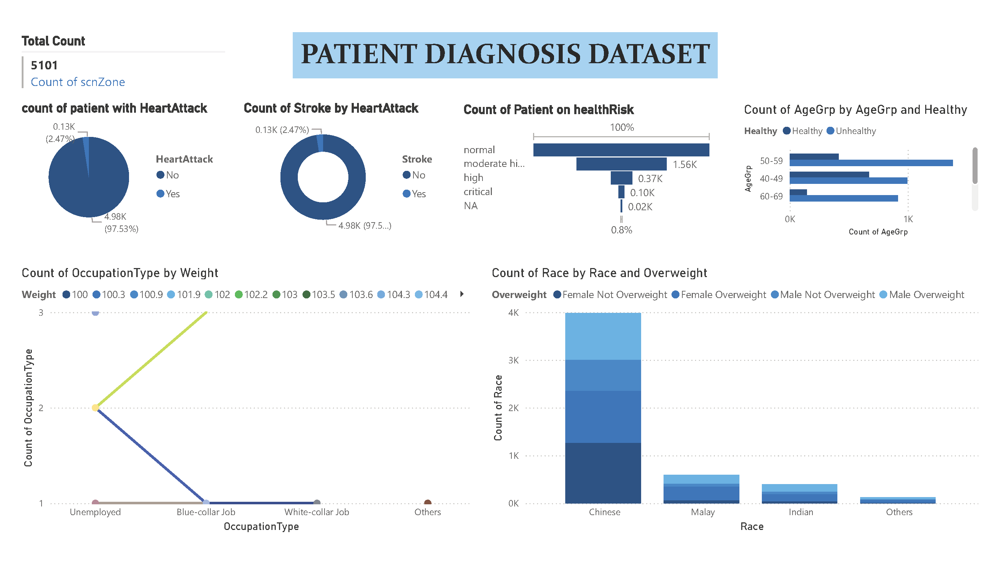

# Patient Diagnosis Data Analysis with Power BI

## Overview
This project uses Power BI to analyze patient diagnosis data, uncovering insights into health risks, demographics, and lifestyle factors. The interactive dashboard visualizes various health metrics, including heart attack and stroke rates, weight distribution by occupation, and age-based health trends.



## Features
- **Heart Attack & Stroke Analysis**: Correlation between heart attack and stroke occurrences.
- **Health Risk Categorization**: Classify patients into health risk levels.
- **Occupation & Weight Distribution**: Visualize weight distribution across different occupations.
- **Demographic Analysis**: Analyze race, gender, and weight status.
- **Age Group Health Trends**: Explore health status across different age groups.
- **Lifestyle & Health Factors**: Study the impact of habits and education levels.

## Data
The dataset consists of 28 attributes including:
- **Demographics**: Gender, age group, race.
- **Health Indicators**: BMI, diabetes, heart attack, stroke, blood pressure, cholesterol.
- **Lifestyle Factors**: Habits, occupation.
- **Other Variables**: Health risks, education level, and scnZone.

## Visualizations
- **Bar charts**: Patient distribution by health risk levels.
- **Stacked bar charts**: Stroke occurrences by heart attack status.
- **Scatter plots & bar charts**: Weight distribution across occupations.
- **Demographics**: Breakdown by race, gender, and weight status.
- **Lifestyle factors**: Correlation with health outcomes.

## Getting Started
1. Clone this repository:
   ```ruby
   git clone https://github.com/shreyaskhochikar/Power-BI-PATIENT-DIAGNOSIS-DATASET.git
2. Open the PatientDiagnosis.pbix file in Power BI Desktop.
3. Interact with the visualizations and explore the data insights.

## Requirements
 - Power BI Desktop
 - Basic understanding of data analysis
